# AVARICE ISLAND

## Description

## How to Open Project in Unity 2019.2.19
Go to https://unity3d.com/get-unity/download and download unity hub
Save the file and run the executable

 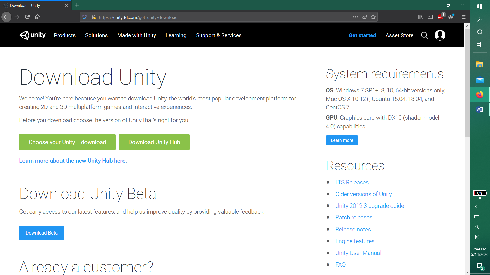

After opening unity hub you will need a license to use unity. They offer free ones to people who use unity but don’t make a monitory value out of what they create from it.
You need to click manual activation in the top right off unity and save your license request,
The file is called Unity_lic.alf  you will need this file later so save it somewhere you can find it.
 
 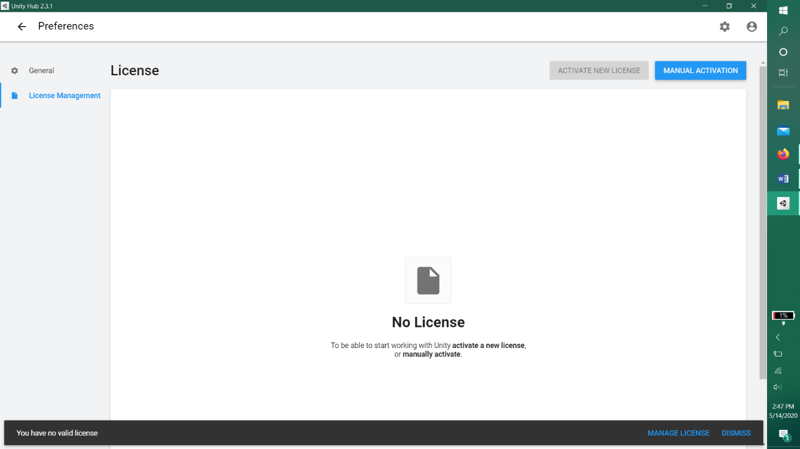
 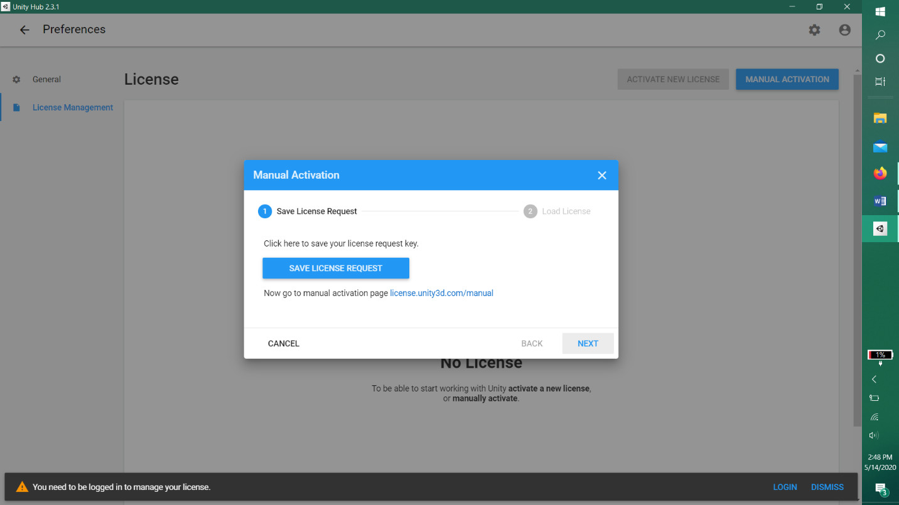

After saving the file go to    https://license.unity3d.com/manual    and click browse, then find the file you saved in the step above. You will need to create a unity ID to do this. If you click browse without signing in it will take you to the sign in screen, you need to create an account if you don’t have one, after signing in click the license link again. You need to verify your email so you can’t put gibberish into the account creation page.  
 
 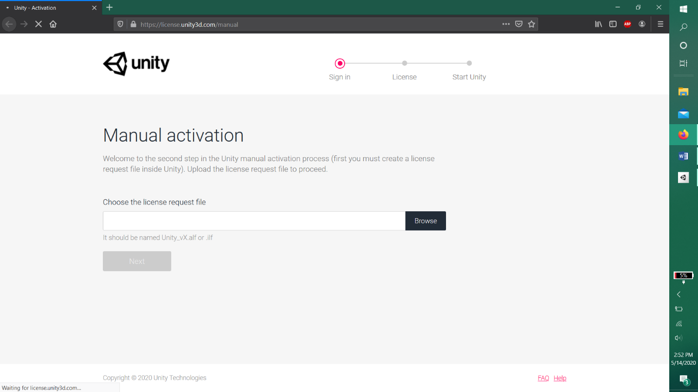

After selecting the file, you will have to choose unity personal edition, choosing “I don’t use unity in a professional capacity” gives you the least amount of hurdles to jump through
 
  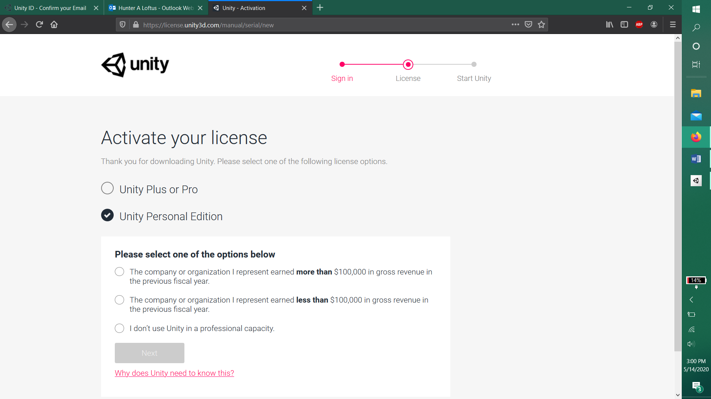

After clicking next you need to download your new license file, you need to save this in a place you can find it. Don’t get this one mixed up with the file you saved in a previous step
 
  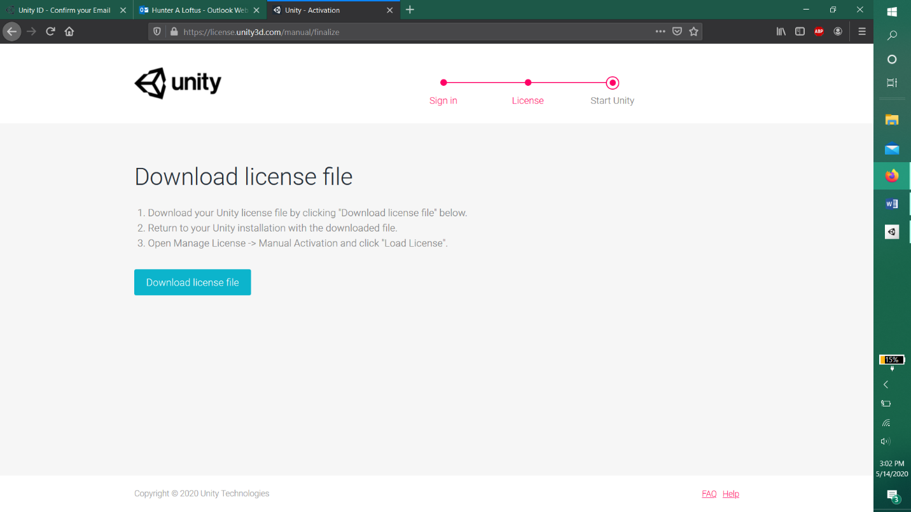

Now go back to unity Hub and sign in with your new account, go back to the “save license request” screen when you click “manually activate license” click the option next, then find the license file you just saved from the unity license website. Hopefully the screen will change and you now will see you have a personal license
  
 
 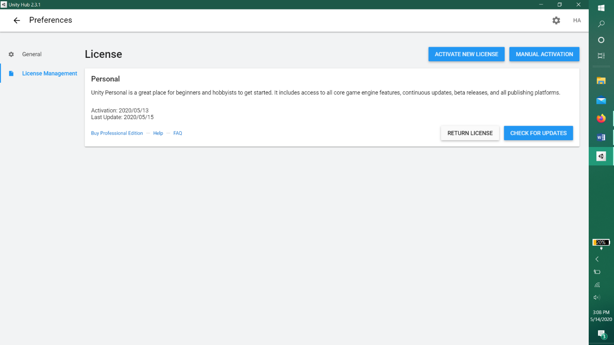

Click the arrow back in the upper left and go to the installs tab. Click add in the upper right and download the latest release. You don’t need to download any extra modules. This takes a bit so please clone our repository from github   https://github.com/JSantiPearson/Avarice-Island
 
  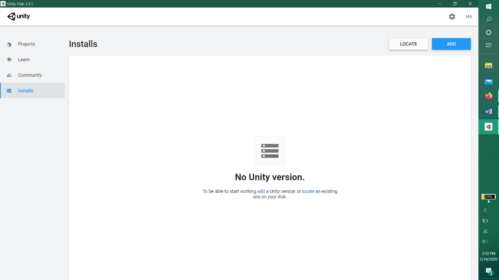

After downloading the unity version go to the projects tab on the left, click add and find and select our parent Avarice Island folder. Select your unity version, it might yell at you for having a newer version but we found no issues moving up. This takes about 5 minutes to get everything imported and settled for the first time.
 
  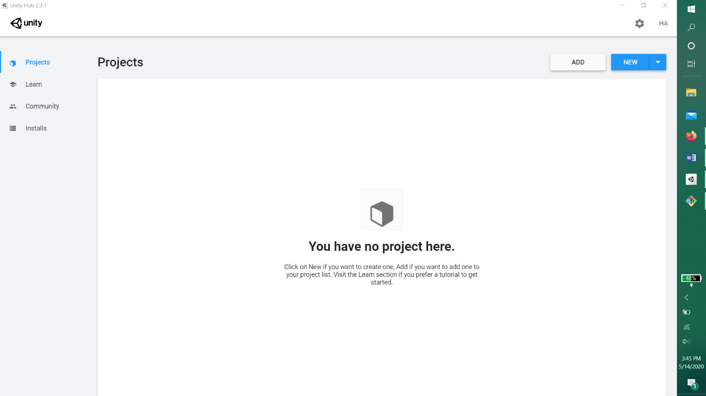

When it first opens you’ll be greeted with this scene, in the bottom section click on scenes then Game, Change the aspect ratio to 16:9. Push the play button in the top middle and enjoy!

 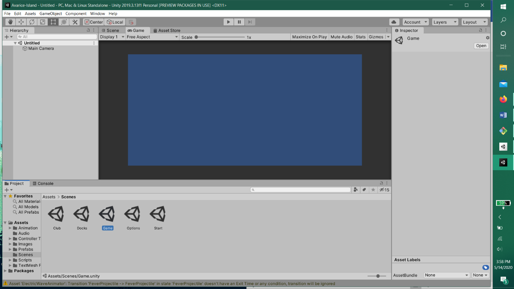
 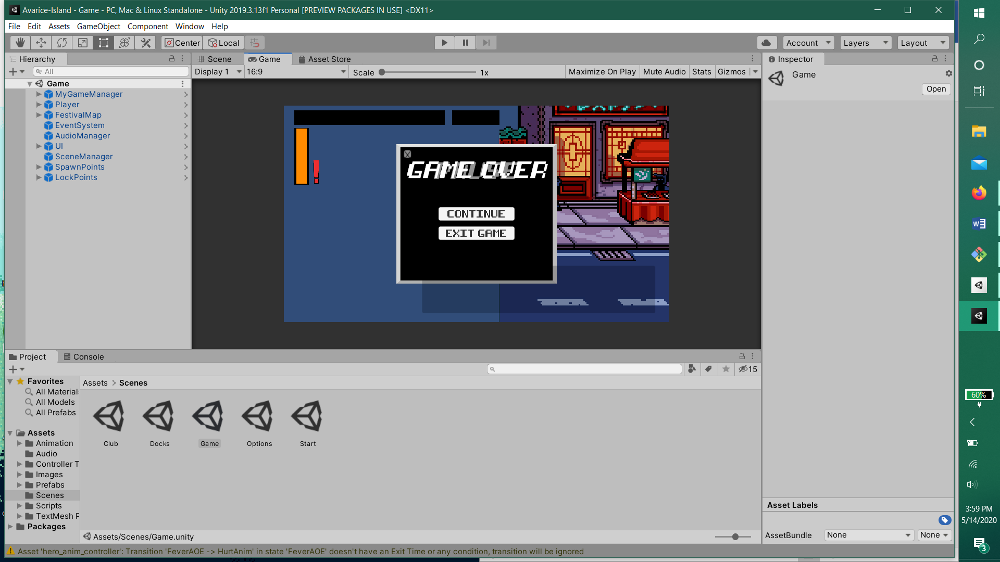

 
Controls:
Arrow keys move you around (Double tap to sprint)

A = attack
E = Fever AOE
E + up arrow = Fever Grab
E + side arrows = Projectile
S = Jump
P = pause

## Known Bugs

-The animator will have priority issue and some animations will play in situations where they should not

-The Fever projectile has inconsistent speed issues

-Enemies will run to places that look strange with the backdrop (Like they start climbing the wall)

-Enemies will sometimes spawn on top of each other and get flown

